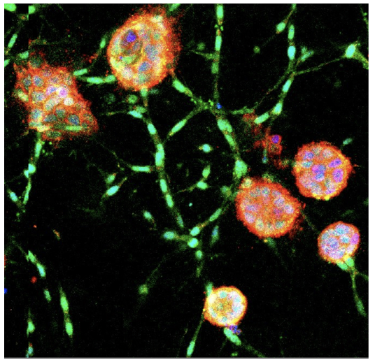
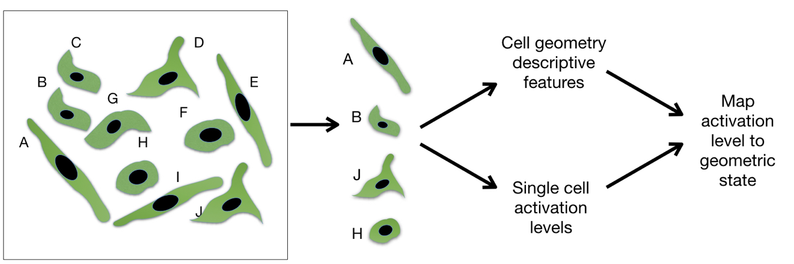
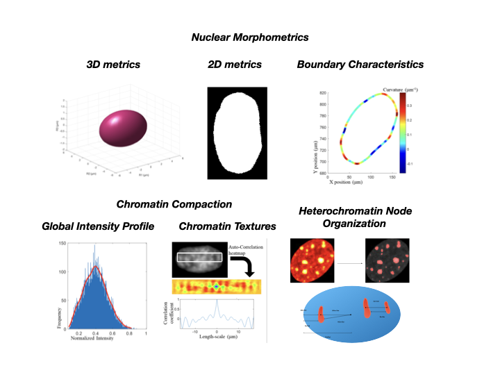
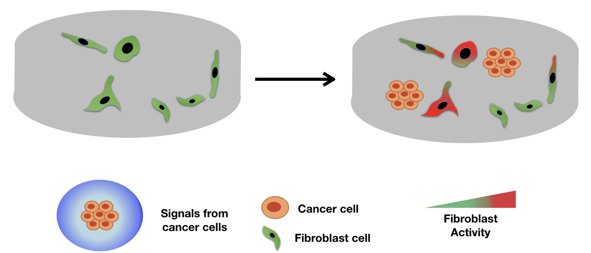

# Multivariate analysis reveals activation-primed fibroblast geometric states in engineered 3D tumor microenvironments
Analysis from the paper Saradha et.al. MBoC 2020. 

Fibroblasts are a heterogenous group of cells in the connective tissue comprising of subpopulations that have been found to be activated in the stromal microenvironment that regulate tumor initiation and growth. The underlying mechanisms of such selective activation of fibroblasts are not understood. We hypothesized that the intrinsic geometric heterogeneity of fibroblasts modulates the nuclear mechanotransduction of signals from the microenvironment, resulting in their selective activation.

In this paper, we present a novel method for engineering 3D in-vitro model of breast cancer progression. Below is a micrograph of cancer spheroids (red) embedded with normal fibroblasts. 
 

 

In this study, we compute multiple features that decribe nuclear morphology and DNA condensation patterns as a sensor of cell geometry. We perform a dimension reduction to obtain a latent space vector to delineate cells of different geomteries. Further, we use linear regression models to model the relationship between cell morphology and activation levels. 

 

 

 

 

Breifly, our study established the existence of activation primed cell shapes and demonstrated a causal relationship between cell geometry and activation. 

 

 

For more details visit [our paper](https://www.molbiolcell.org/doi/full/10.1091/mbc.E19-08-0420).  

Please cite our paper if you are using this code in your research.

Venkatachalapathy, Saradha, Doorgesh Sharma Jokhun, and G. V. Shivashankar. "Multivariate analysis reveals activation-primed fibroblast geometric states in engineered 3D tumor microenvironments." Molecular Biology of the Cell 31, no. 8 (2020): 803-812.

